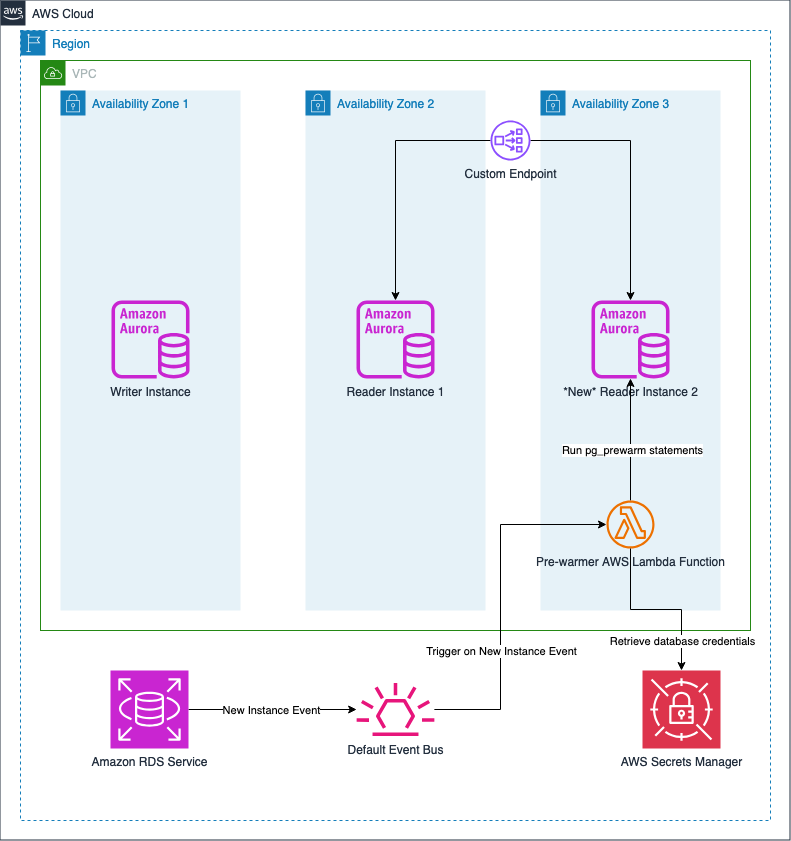

# Aurora Postgres Auto-Scale Prewarmer

## Overview
Currently, when new Aurora read-replicas are created, whether via auto-scaling or manually adding new replicas, the buffer caches are empty. These caches take time to build up and will automatically happen as the application continues to send queries to the replicas. For latency sensitive application, the time it takes to fill up the cache may not be acceptable because it has a direct impact on query time. 

This solution uses the events that RDS emits to Amazon EventBridge when new DB Instances are created. If the new DB Instance is part of an Aurora cluster that's configured with this solution, then it would connect to the new DB Instance and run pg_prewarm on the configured list of tables to load them into the buffer caches.

The application should connect via [custom endpoint](https://docs.aws.amazon.com/AmazonRDS/latest/AuroraUserGuide/Aurora.Overview.Endpoints.html#aurora-custom-endpoint-creating) and configure the custom endpoint as part of the input of this solution. Pre-warmed nodes would then get automatically be added to the custom endpoint and be part of the rotation.

## Solution Overview

### Architecture


### Requirements
1. CDK
2. `pg_prewarm` extension. Load the extension using: `CREATE EXTENSION IF NOT EXISTS "pg_prewarm"`
3. Custom endpoint pre-created
4. Docker 

### Solution Flow
1. RDS emits various [types of events](https://docs.aws.amazon.com/AmazonRDS/latest/AuroraUserGuide/USER_Events.Messages.html). We will be using this mechanism to trigger the prewarming Lambda function when a new DB instance event is sent to Amazon EventBridge. 
2. Since the events that are emitted is at the DB Instance level, cluster information is not included in the event payload. The pre-warming will only trigger if the DB instance in the event is a member of the DB Cluster that's configured with the pre-warmer.
3. The prewarmer will connect to the DB instance using `ts-postgres` driver and run the `pg_prewarm` against all the tables listed in the `itemsToPrewarm` parameter.
4. Once all the tables have been pre-warmed, it would then update the custom endpoint to add the new DB instance.

### Deploying
1. Clone the repository
2. Run `npm install`
3. If this is the first time that you're using CDK, make sure you follow the [bootstrap guide](https://docs.aws.amazon.com/cdk/v2/guide/bootstrapping-env.html)
4. Open the `cdk.context.json` and populate the parameters. All of them are required.
5. Run `cdk deploy` (make sure you have the Docker daemon running in your local machine or where you're deploying from). You should see a breakdown of what's going to be deployed. Confirm and wait for the deployment to finish.
6. The solution would automatically trigger when a new read replica is deployed.

## Demo Setup

If you need test data to sample the effectivity of the prewarmer, you can use the following SQL statement to generate 60M records.

```
CREATE EXTENSION IF NOT EXISTS "uuid-ossp";
create table sample_table(id character varying(100), quantity integer, price numeric, encrypted_name character varying(100));
insert into sample_table select uuid_generate_v4(), random()*10, random()*100, md5(random()::text) from generate_series(1, 10000000);
insert into sample_table select uuid_generate_v4(), random()*10, random()*100, md5(random()::text) from generate_series(1, 10000000);
insert into sample_table select uuid_generate_v4(), random()*10, random()*100, md5(random()::text) from generate_series(1, 10000000);
insert into sample_table select uuid_generate_v4(), random()*10, random()*100, md5(random()::text) from generate_series(1, 10000000);
insert into sample_table select uuid_generate_v4(), random()*10, random()*100, md5(random()::text) from generate_series(1, 10000000);
insert into sample_table select uuid_generate_v4(), random()*10, random()*100, md5(random()::text) from generate_series(1, 10000000);
```
To compare the timing using `psql`, make sure to enable query execution time output using `\timing`. Test 2 scenarios:

1. Provision a fresh read replica, connect to it and run the following query after enabling `\timing`: `select avg(price) from sample_table where quantity>5`.
2. Deploy the prewarmer solution, and rerun the test with a freshly deployed read replica.

You should see timing differences between the two.